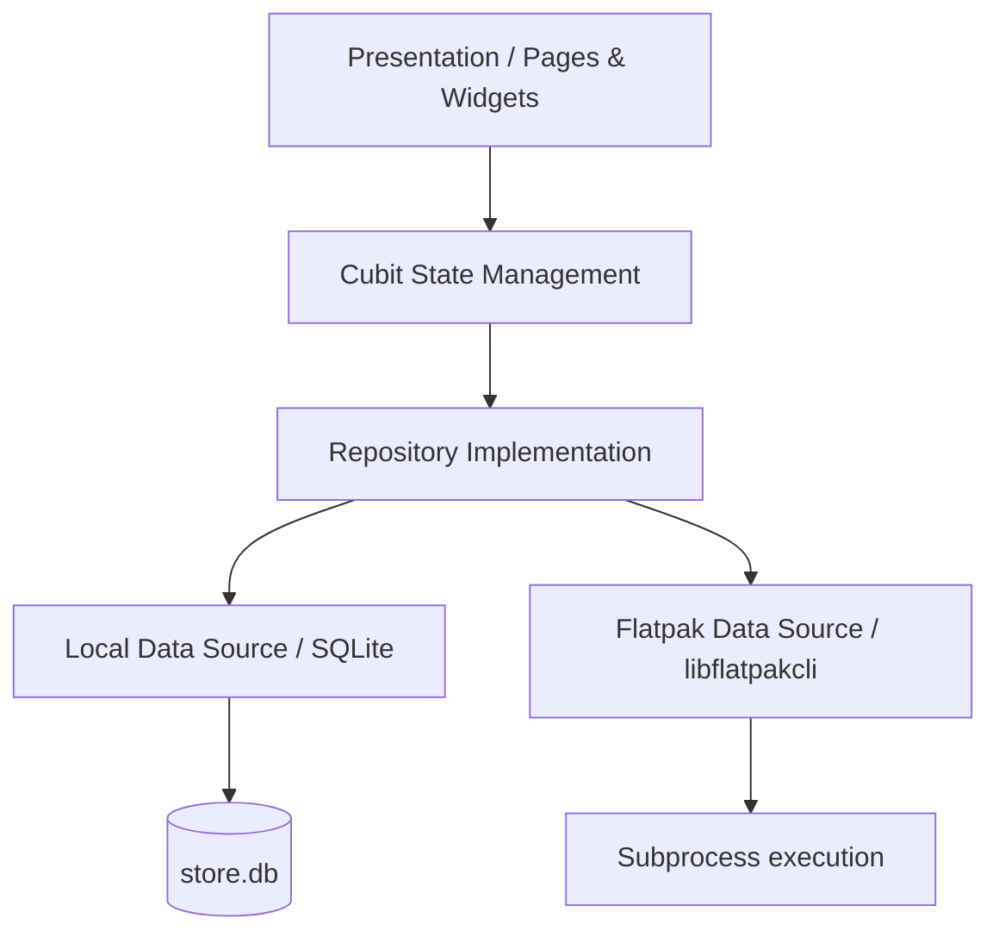

# 🎮 Linux App & Game Store Client

[](https://flutter.dev)
[](https://linux.org)
[](https://flatpak.org)
[](#architecture--technical-design)

A modern, high-performance desktop App & Game Store client built with Flutter for Linux systems. This client integrates directly with Flatpak via `libflatpakcli` to enable searching, browsing, installing, managing, and updating desktop applications and games through a visually stunning, glassmorphic UI.

Designed for both traditional desktop usage and couch-gaming setups, the application features native, focus-driven keyboard navigation, smooth micro-animations, and a robust offline fallback system.

---

## ✨ Key Features

- 📦 **Apps & Games Catalog**: Explore and filter a massive collection of Linux software and games categorized via an embedded metadata catalog.
- 🔍 **Real-time Search & Filtering**: Fast, paginated searching across names, developers, categories, and summaries.
- 🏛️ **My Library (Installed Apps)**: Automatically lists installed Flatpaks and allows you to launch them directly from the app using detached background subprocesses (`flatpak run <ref>`).
- 🔄 **Updates Page (OTA Management)**: Detects pending system/app Flatpak upgrades and performs one-click updates with progress tracking.
- ⚙️ **Lifecycle Management**: Streamed progress bars for installation, removal, and upgrading, reading stdout buffers for real-time percentages.
- 🛠️ **Detailed Inspector Panel**: In-depth information for developers and enthusiasts, including Flatpak Reference (ref), Runtime/SDK requirements, Architectures, Branch details, Download Size, and Installed Size.
- 🖼️ **Screenshot Gallery**: High-resolution screenshots with an immersive, interactive lightbox viewer.
- 🎮 **Couch-Ready Keyboard Navigation**: Fully-featured navigation framework using arrow keys and focus handlers, making it ready to run on gaming consoles or media centers.
- 🎨 **Next-Gen Glassmorphic UI**: Vibrant styling utilizing backdrop filters, dynamic gradients, custom shimmers, and rich hover states.

---

## 🏛 Architecture & Technical Design

The codebase implements **Clean Architecture** patterns separated into distinct folders to ensure high testability, maintainability, and loose coupling.



### Key Technologies Stack
* **State Management**: `flutter_bloc` / Cubit for decoupled business logic and reactive UI updates.
* **Dependency Injection**: `get_it` service locator for registering repositories, cubits, and database handlers.
* **Database Caching**: `sqflite_common_ffi` to interact with a bundled database asset (`assets/db/store.db`) containing app catalogs.
* **Functional Programming Utilities**: `dartz` (Either type) for clean, type-safe error handling.
* **Subprocess Communication**: Non-blocking asynchronous process streams (`Process.start` / `Process.run`) interfacing with `libflatpakcli` to run native operations.

---

## 📂 Project Structure

Below is the directory layout of the application's source code:

```
lib/
├── core/
│   ├── navigation/                 # Focus handling and arrow navigation managers
│   │   ├── focus_handler.dart
│   │   └── keyboard_navigation_manager.dart
│   ├── theme/
│   │   └── app_theme.dart          # Glassmorphic, dark theme system
│   └── utils/
│       ├── constants.dart          # System-wide assets and styling tokens
│       ├── extensions.dart
│       ├── gradients.dart          # Harmonious custom background gradients
│       ├── logger.dart
│       └── validators.dart
├── features/
│   ├── categories/                 # Category browsing models & cubits
│   │   ├── data/
│   │   │   ├── datasources/categories_local_data_source.dart
│   │   │   └── repositories/categories_repository_impl.dart
│   │   └── presentation/
│   │       └── cubit/
│   ├── game/                       # Game details presentation & operations
│   │   └── presentation/
│   │       ├── cubit/game_details_cubit.dart
│   │       └── pages/game_details_page.dart
│   ├── games/                      # App/game listings, search, library, and upgrades
│   │   ├── data/
│   │   │   ├── datasources/
│   │   │   │   ├── flatpak_data_source.dart         # Process streaming & CLI parsing
│   │   │   │   └── games_local_data_source.dart     # SQLite interactions
│   │   │   ├── models/
│   │   │   │   ├── flatpak_transaction_operation.dart
│   │   │   │   └── game_model.dart
│   │   │   └── repositories/
│   │   │       └── games_repository_impl.dart
│   │   └── presentation/
│   │       ├── cubit/
│   │       ├── pages/
│   │       │   ├── apps_page.dart
│   │       │   ├── developer_page.dart
│   │       │   ├── games_page.dart
│   │       │   ├── library_page.dart
│   │       │   └── updates_page.dart
│   │       └── widgets/
│   │           └── game_card.dart
│   └── home/                       # Navigation shell sidebar and global layout
│       └── presentation/
│           └── pages/home_page.dart
├── main.dart                       # App entry point and multi-BLoC bootstrapper
└── service_locator.dart            # Service locator registration file
```

---

## 🛠️ Requirements & System Setup

To build and run the application natively on Linux, ensure you have the following packages installed:

```bash
# Ubuntu / Debian / Pop!_OS
sudo apt update
sudo apt install clang cmake ninja-build pkg-config libgtk-3-dev liblzma-dev sqlite3 libsqlite3-dev flatpak

# Fedora
sudo dnf install clang cmake ninja-build pkg-config gtk3-devel lzma-devel sqlite-devel flatpak

# Arch Linux
sudo pacman -S clang cmake ninja pkg-config gtk3 sqlite flatpak
```

### Flatpak & CLI Utility
The app relies on `libflatpakcli` for transaction streaming. If the CLI utility is not present on the developer system, `FlatpakDataSourceImpl` automatically shifts to a **simulated mock fallback** (instantly enabling app previews, installation streams, and removal simulations) allowing full UI testing without having Flatpak configurations active.

---

## 🚀 Getting Started

Follow these steps to run the project locally:

1. **Clone the repository**:
   ```bash
   git clone <repo_url> game_store
   cd game_store
   ```

2. **Retrieve dependencies**:
   ```bash
   flutter pub get
   ```

3. **Run in development mode (Linux desktop)**:
   ```bash
   flutter run -d linux
   ```

4. **Build the production release bundle**:
   ```bash
   flutter build linux --release
   ```
   The compiled output will be generated under `build/linux/x64/release/bundle/game_store`.

---

## 🔧 Flatpak Subprocess Integration Details

The client communicates with the background daemon via terminal subprocess streams. When triggering transactions such as installation:
1. It executes `libflatpakcli install system flathub <ref>`.
2. It parses the initial stdout header containing transaction metadata (like dependency resolution JSON).
3. It listens to chunk streams separated by a null byte (`0`) to obtain real-time progress percentages.
4. It catches standard error output and displays clean dialogs if installations fail (e.g. connection lost or missing credentials).

This architecture guarantees that the Flutter UI remains completely responsive and lag-free, regardless of how heavy the Flatpak transaction is.
